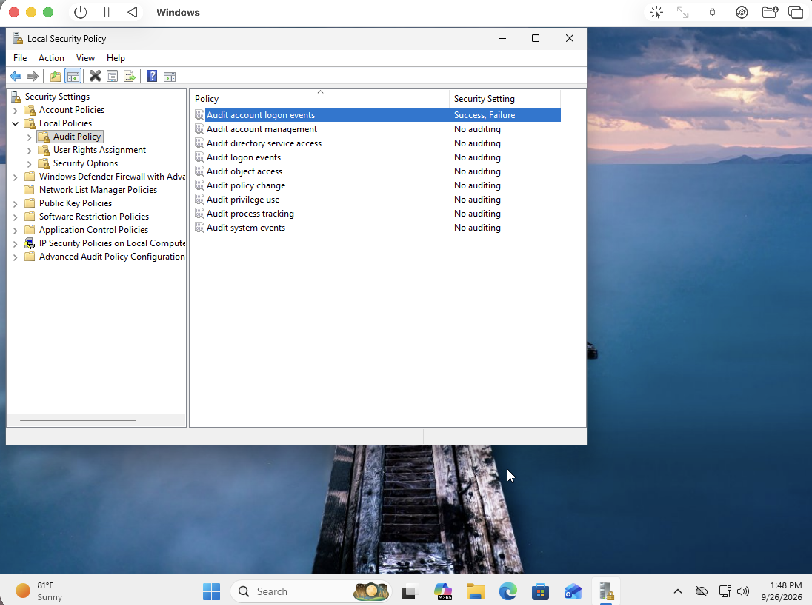
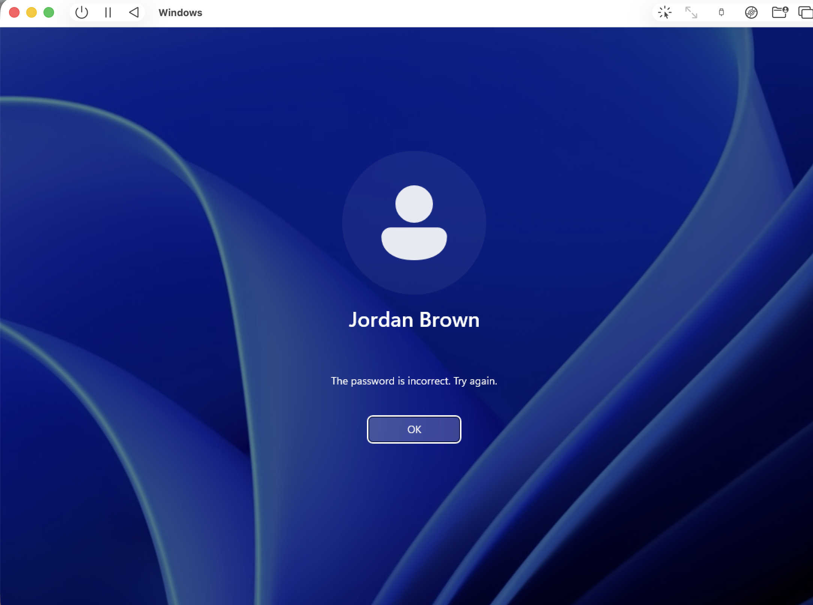
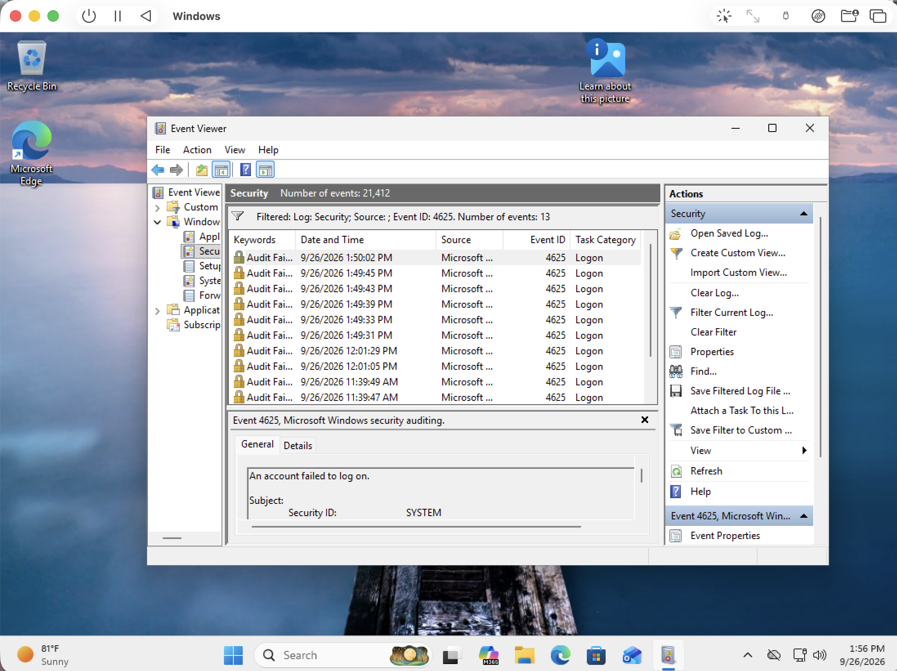
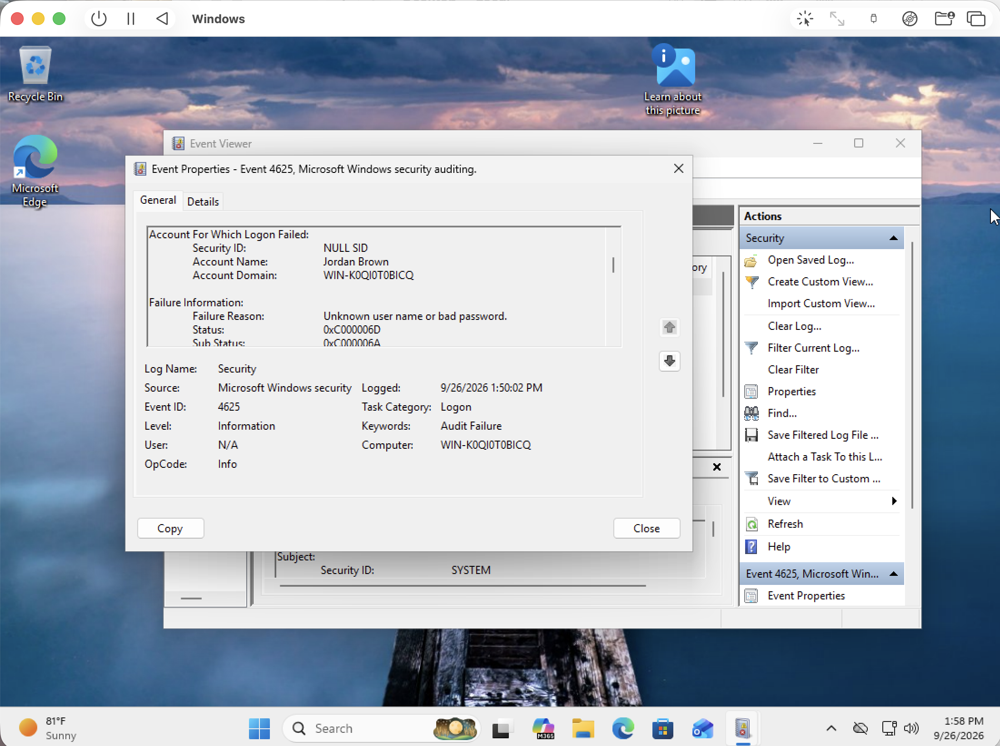
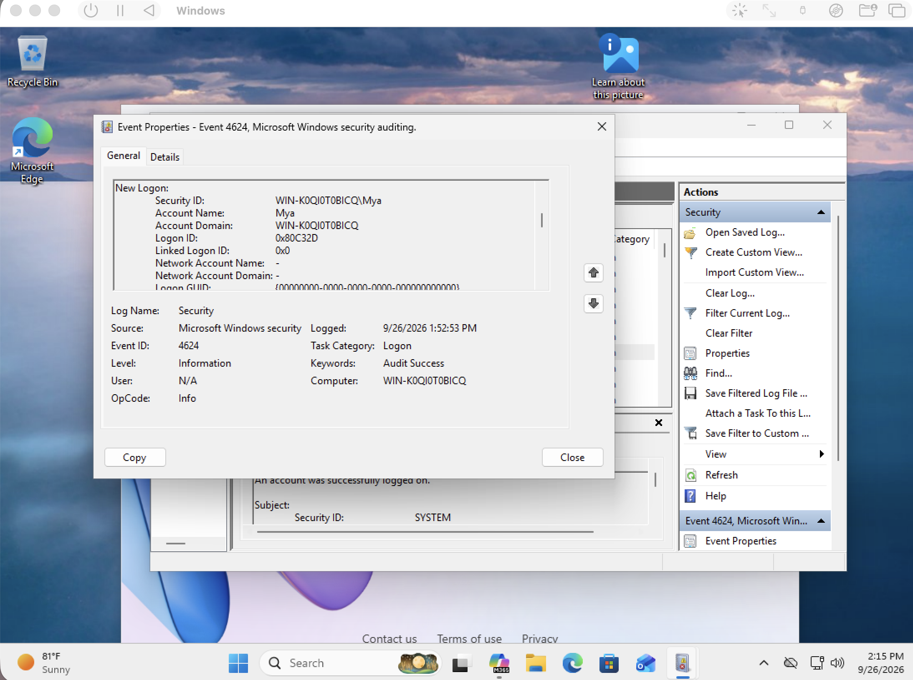

# Incident #001 — Repeated Failed Login Attempts

**Incident ID:** SOC-001  
**Affected User:** Jordan Brown  
**Severity:** Low  
**Status:** Closed  

## Scenario

Multiple unsuccessful login attempts were observed against Jordan Brown's Windows account. The activity was investigated using Windows Security event logs to determine when the attempts occurred, which account was targeted, why authentication failed, and whether access was eventually successful.

## Investigation Findings

- Multiple failed logon events were identified in the Windows Security log.
- Event ID: 4625
- Targeted account: Jordan Brown
- Failure reason: Unknown user name or bad password
- Status: `0xC000006D`
- Sub Status: `0xC000006A`
- Interpretation: Incorrect password
- Failed attempts occurred within a short time period.

## Successful Logon Review

- Event ID 4624 activity immediately following the failed attempts was reviewed.
- A successful logon was identified at 1:52:53 PM for the Mya administrator account.
- No successful Jordan Brown authentication was identified in the relevant post-failure time window.
- Earlier Jordan Brown logons from normal lab activity were excluded from the incident scope.

## Conclusion

Multiple failed authentication attempts were recorded against Jordan Brown within a short time period. Security Event ID 4625 showed that the attempts failed because of an incorrect password. Review of Event ID 4624 activity did not identify a successful Jordan Brown login immediately following the failed attempts.

Based on the reviewed evidence, the authentication failures did not result in successful access to the Jordan Brown account during the incident window.
## Screenshots

### Logon Auditing Enabled

### Failed Login Attempt

### Failed Logon Events

### Event Details

### Post-Failure Logon Review

